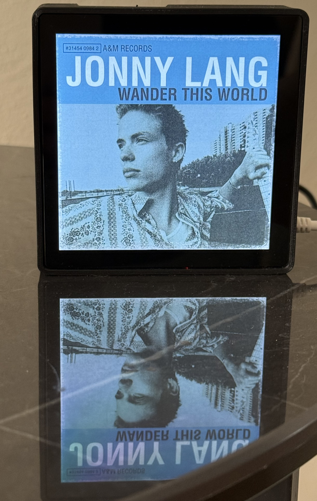

# SonosPi



SonosPi is a Raspberry Pi–powered display that shows the currently playing album art from your Sonos system. Designed to be simple, unobtrusive, and always-on, it turns off the screen when playback is paused and wakes it when music resumes.

Credit for the concept and original version goes to **Mark Hank**, who wrote a fantastic how-to guide that you'll find here: [https://www.hackster.io/mark-hank/sonos-album-art-on-raspberry-pi-screen-5b0012.](https://www.hackster.io/mark-hank/sonos-album-art-on-raspberry-pi-screen-5b0012.)

This rewrite was created because the original version stopped working due to updated dependencies. It's functionally close to the original but lacks support for track name overlay. It now includes optional touchscreen playback controls and enhanced logging.

## Features

* Auto-detects Sonos speaker groups and their coordinators
* Fetches and displays album art directly to the framebuffer (no `fbi` dependency)
* Avoids flicker by skipping redundant updates
* Automatically blanks the screen when nothing is playing or no album art is available
* Optional touchscreen single-tap (play/pause) and double-tap (next track) support
* Works on Raspberry Pi OS Bookworm (tested on Pi 3A+ with a HyperPixel Square)
* Systemd service for running on boot
* Log rotation built in with detailed playback and touch interaction logs

---

## Raspberry Pi 3A+ and HyperPixel Setup Notes

If you have an older Pi like the 3A+, you may need extra setup:

1. **Use Raspberry Pi OS Bookworm Lite**
   - Download the Lite (headless) version.
   - Avoid the desktop version for smoother framebuffer display.
2. **Enable SPI and I2C** in `raspi-config`.
3. **Install legacy HyperPixel drivers** from the [pimoroni/hyperpixel4 repo](https://github.com/pimoroni/hyperpixel4).
4. **Target the correct framebuffer** (`/dev/fb0` for most, `/dev/fb1` for HyperPixel).
5. For touchscreen support, install `evdev`:
```bash
pip3 install evdev
```

---

## Hardware
* Raspberry Pi (tested on 3A+)
* Framebuffer-connected display (HyperPixel Square or similar)
* Touchscreen-capable display (optional, for touch controls)

## Software
* Raspberry Pi OS Bookworm Lite
* Python 3
* `soco`, `requests`, `Pillow`, `evdev` (for touch)

Install dependencies:
```bash
sudo apt install python3-pip
pip3 install soco requests Pillow evdev
```

---

## Setup

1. Clone this repo:
```bash
git clone https://github.com/amarks/sonospi.git
cd sonospi
```
2. Make script executable:
```bash
chmod +x sonos_album_art_loop.py
```
3. (Optional) Set environment variables for touch sensitivity:
```bash
export TOUCH_DBL_TAP_MS=400  # Double-tap window in ms
export TOUCH_RESUME_REWIND_SEC=5  # Threshold for rewinding near end
export TOUCH_RESUME_BACK_SEC=3    # Seconds to rewind when resuming
```
4. Test manually:
```bash
./sonos_album_art_loop.py
```
5. Install the systemd service:
```bash
sudo cp sonospi.service /etc/systemd/system/
sudo systemctl enable sonospi
sudo systemctl start sonospi
```

---

## Logging
Logs go to `~/sonospi.log` with rotation. Includes speaker discovery, album art source, and touch interactions.

---

## Screen Rotation
If needed, edit `/boot/config.txt`:
```
display_lcd_rotate=1
```
Values: 0=0°, 1=90°, 2=180°, 3=270°.

---

## Troubleshooting
* **Blank screen?** Ensure the correct framebuffer is used.
* **No art?** Ensure a Sonos group is playing and reachable; verify that the track actually has album art.
* **Blinking cursor?** Add `vt.global_cursor_default=0` to `/boot/cmdline.txt`.
* **Touch not working?** Ensure `evdev` is installed and your device is detected in `/dev/input/event*`.

---

## License
MIT

---

## Credits
* **Mark Hank** – Original Sonos album art project
* [SoCo](https://github.com/SoCo/SoCo) – Sonos control library
